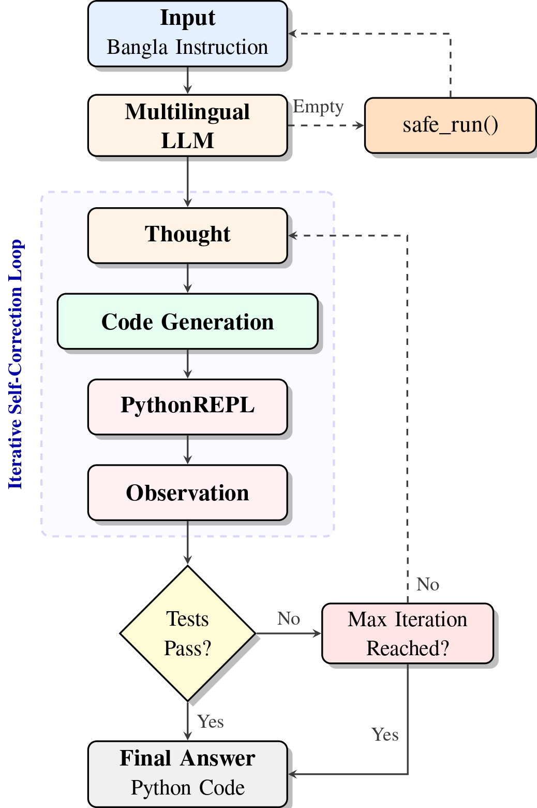

# PyBanglaCodeAct

<p align="center">
  
</p>

<p align="center">
  <a href="https://github.com/jahidulzaid/PyBanglaCodeActAgent/blob/main/LICENSE">
    
  </a>
  <a href="https://www.python.org/">
    
  </a>
  <a href="https://github.com/jahidulzaid/PyBanglaCodeActAgent/stargazers">
    
  </a>
  <a href="https://github.com/jahidulzaid/PyBanglaCodeActAgent/issues">
    
  </a>
</p>

## What this is
PyBanglaCodeAct is a CodeAct/REACT-style agent for Bangla (Bengali) programming tasks. It accepts Bangla instructions, plans, generates Python code with multilingual LLMs (for example, Qwen3-8B), executes that code in a sandboxed REPL, and iteratively self-corrects through a Thought -> Code -> Observation loop. The agent reaches 94.0% pass@1 on the mHumanEval Bangla development set and demonstrates the effectiveness of execution-aware generation for low-resource languages.

## Architecture


## Install
```bash
git clone https://github.com/jahidulzaid/PyBanglaCodeActAgent.git
cd PyBanglaCodeActAgent
python -m venv .venv
# Windows
.\.venv\Scripts\activate
# Linux/macOS
source .venv/bin/activate
pip install --upgrade pip
pip install -r requirements.txt
# optional CLI install
pip install -e .
```

## Run
- Default dev split:
```bash
python PyBanglaCodeAct.py --input dev.csv --output submission.json
```
- Custom:
```bash
python PyBanglaCodeAct.py --input dev.csv --output submission.json --model "Qwen/Qwen3-8B" --retries 15 --seed 42
```
- Minimal example:
```bash
python zero-result_baseline/example.py
```

## Data and output
- Input CSV columns: `id` (int), `instruction` (Bangla task), `test_list` (stringified list of assert statements).
  ```csv
  id,instruction,test_list
  1,"Write a function add(a, b) that returns their sum","['assert add(2, 3) == 5', 'assert add(-1, 1) == 0']"
  ```
- Output JSON:
  ```json
  [
    {
      "id": 1,
      "response": "def add(a, b):\n    return a + b"
    }
  ]
  ```

## CLI options
`python PyBanglaCodeAct.py` (or `pybanglacodeact` if installed):

| Option | Default | Description |
|---|---|---|
| `--input` | `dev.csv` | Input CSV with `id`, `instruction`, `test_list` |
| `--output` | `submission.json` | Output JSON (a zip with same stem is also written) |
| `--model` | `Qwen/Qwen3-8B` | Model name for vLLM |
| `--retries` | `15` | Max retries per task |
| `--seed` | `42` | Random seed |

More tuning knobs live in `config.py` (iterations, temperature, timeouts).

## Evaluation
- From repo root with `submission.json` present:
```bash
python scoring/scoring.py
```
Set `reference_dir` and `prediction_dir` inside the script if your files are elsewhere. Alternate evaluator: `test_phase/scoring_v2.py` (configure `CSV_PATH` and `SUB_PATH`).

## Repo map
- `PyBanglaCodeAct.py` - main CLI and agent runner
- `config.py` - defaults for model, sampling, agent behavior
- `docs/` - quick start and contributing guides
- `scoring/`, `test_phase/` - evaluation scripts and test splits
- `dev.csv`, `trial.csv` - datasets
- `zero-result_baseline/` - simple example script
- `dev_phase/` - experimental runs and prompts

## Results

| Model | Method | Pass@1 (Dev) | Pass@1 (Test) |
|-------|--------|--------------|---------------|
| **Qwen3-8B** | **BanglaCodeAct** | **94.0%** | **71.6%** |
| Qwen3-8B | Self-consistency | 90.0% | - |
| Qwen2.5-14B | BanglaCodeAct | 85.0% | - |
| DeepSeek-Coder-V2 | BanglaCodeAct | 71.4% | - |
| Llama-3.1-8B | Zero-shot | 45.0% | - |

## Contributing
PRs welcome. See `docs/CONTRIBUTING.md` for workflow and testing guidance.

## Citation
```bibtex
@article{islam2025pybangla,
  title={PyBangla at BLP-2025 Task 2: Enhancing Bangla-to-Python Code Generation with Iterative Self-Correction and Multilingual Agents},
  author={Islam, Jahidul and Ataullha, Md and Azad, Saiful},
  journal={arXiv preprint arXiv:2512.23713},
  year={2025}
}
```
